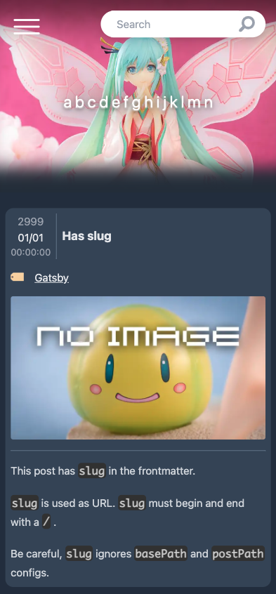

# gatsby-starter-figure-blog



[](https://app.netlify.com/sites/gatsby-starter-figure-blog/deploys)

[日本語ReadMeはこちら。](./README-ja.md)

The blogging starter that is suitable for Bishoujo Figure photographs.
You can start your own bishoujo figure review blog right now❗

Using the Gatsby theme
[`@tenpaMk2/gatsby-theme-figure-blog`](https://github.com/tenpaMk2/gatsby-theme-figure-blog)
.

## Demo

[View demo❗](https://gatsby-starter-figure-blog.netlify.app/)

## My blog

[tenpaMk2's blog](https://tenpamk2-blog.netlify.app/)

## ✨ Features

- Make your photos look as large as possible.
- Responsive
- Hero image
  - If it's portrait, focus (crop) on the top side. Since the figure's face is often there❗
- Generate post title from filename
- Pure Markdown not MDX
- [Special hooks](https://github.com/tenpaMk2/gatsby-theme-figure-blog/tree/main/theme/README.md#special-hooks)
- Code highlighting by [Prism.js](https://prismjs.com/)
- Dark mode only
- Tags, archives pages
- Cards layout support in tags and archives page
- Pagination
- Debug page
- Tailwind CSS
- Partial locale support by `Intl`

## 🚀 Getting Started

Before installing starter, you have to install
[`gatsby-cli`](https://www.gatsbyjs.com/docs/reference/gatsby-cli/)
.

```sh
npm install -g gatsby-cli
```

Install starter.
If you have installed Gatsby locally, use `npx gatsby` command instead.

```sh
gatsby new gatsby-starter-figure-blog https://github.com/tenpaMk2/gatsby-starter-figure-blog
```

Change directory, and start a development server.

```sh
cd gatsby-starter-figure-blog
npm run develop
```

Access `http://localhost:8000` .
You can see the blog❗

This starter uses my Gatsby Theme (
[`@tenpaMk2/gatsby-theme-figure-blog`](https://github.com/tenpaMk2/gatsby-theme-figure-blog)
).
If you want to modify this starter, see the following docs.

1. [Gatsby doc: Using a Gatsby Theme](https://www.gatsbyjs.com/docs/how-to/plugins-and-themes/using-a-gatsby-theme/)
2. [Gatsby doc: Using a Theme](https://www.gatsbyjs.com/tutorial/using-a-theme/)
3. [Gatsby doc: Shadowing in Gatsby Themes](https://www.gatsbyjs.com/docs/how-to/plugins-and-themes/shadowing/)
4. [my doc: gatsby-theme-figure-blog](https://github.com/tenpaMk2/gatsby-theme-figure-blog/tree/main/theme)

## 📝 Usage

See
[my doc: gatsby-theme-figure-blog](https://github.com/tenpaMk2/gatsby-theme-figure-blog/tree/main/theme)
.

## 🤔 Questions or problems?

Start a discussion at
[GitHub Discussion](https://github.com/tenpaMk2/gatsby-theme-figure-blog/discussions)
❗
